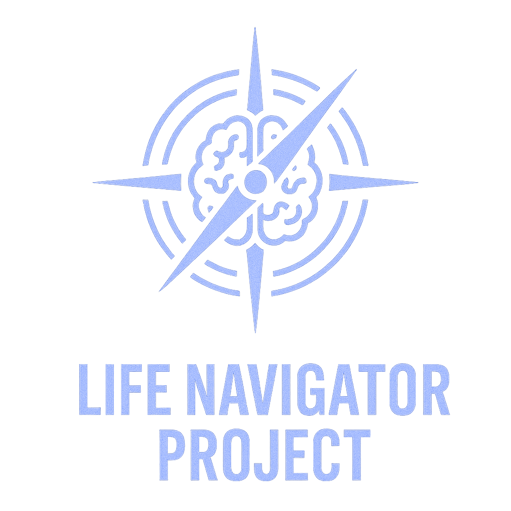

# Life Navigator Project

  

> AI has the potential to make us more human from the inside out as no tool has ever done before.
 — Deepak Chopra

Life Navigator is a deeply personal, AI companion that lives in your private notes and helps you navigate life with greater awareness and intentionality. Unlike generic AI assistants, it builds deep context about your life through daily voice journaling, then reflects patterns you can't see yourself, holds you accountable to your goals, and provides personalized guidance in multiple "modes" - from empathetic reflection to tough-love motivation. It's not just a tool but a new practice of living: where every day you dialogue with an AI that truly knows you, turning the chaos of daily life into structured growth while keeping all your data completely private on your own devices.

Join our community:

  
  
    
  
  <strong>🎯 <a href="https://calendly.com/maciej-cielecki/new-meeting">Book a Free Personal Onboarding Session with the author</a></strong>
   
  Get expert guidance to start your Life Navigator journey
  
    
  
  Follow <a href="http://x.com/mcielecki">@mcielecki</a> for updates

## The Obsidian Plugin

Life Navigator is built as a plugin for [Obsidian](https://obsidian.md), the privacy-first knowledge management app. We chose Obsidian because it aligns perfectly with our core principles: your notes are just markdown files on your computer, you have complete control over your data, and the vibrant plugin ecosystem allows for deep customization. The Life Navigator plugin transforms Obsidian into a powerful AI-augmented journaling and life management system.

### Key Features

#### 🧠 **Context-Aware AI That Knows You Deeply**
Unlike generic ChatGPT, Life Navigator's AI has access to your personal context, goals, relationships, and history through your linked files. It can provide personalized coaching, insights, and guidance based on your actual life situation, not generic responses.

#### 🎭 **Multiple Customizable AI Personalities (Modes)**
Switch between different AI personalities based on your needs:
- **Navigator Mode**: Your daily commander - organizes the day, manages tasks and guides through current affairs
- **Reflection Mode**: Thoughtful, contemplative personality that helps identify patterns you might miss or alert you to correlations (like mood and sleep)
- **Strategy Mode**: Master of long-term planning - creates strategies, visions, roadmaps and guides through big goals
- **Writer Mode**: Your creative writing assistant for any written content
- **Curator Mode**: Your knowledge base organizer and maintenance assistant
- **Custom Modes**: Create your own AI personalities with specific traits, voices, and purposes

#### 🎙️ **Mobile-First Voice Journaling**
Designed for on-the-go use, Life Navigator lets you capture thoughts, update to-do lists, and manage your daily notes using voice input throughout your day. Whether you're commuting, walking, or just want hands-free interaction, simply speak your thoughts and let the AI organize them into your journal and task management system.

#### 🧭 **Full Control Over AI Context**
Through the link expansion system, you have complete control over what information the AI can access. No RAGs, no guessing what AI can see - you explicitly choose what context to share using our special link syntax with the 🧭 emoji.

#### 🔒 **Maximum Data Privacy**
All your personal information is stored locally in your Obsidian vault on your private devices and synced through your own iCloud (or preferred sync service). Unlike other AI tools that store your data in startup databases, Life Navigator keeps everything under your control. The information you choose to share is sent only to trusted API providers (Anthropic and OpenAI) who don't use API data for training ([OpenAI policy](https://community.openai.com/t/data-privacy-with-openai-api/929399), [Anthropic policy](https://privacy.anthropic.com/en/articles/7996868-is-my-data-used-for-model-training)) and have strong data retention policies.

### Getting Started

1. [Install Life Navigator](library/en/Docs/Installation.md) in your Obsidian vault
2. Complete the guided setup with language selection and API key configuration
3. Start using the pre-built LifeNavigator mode or create your own custom modes or download additional modes from the [Life Navigator Library](library/)
4. **Optional**: [Book a free personal onboarding session](https://calendly.com/maciej-cielecki/new-meeting) to get expert guidance

### Documentation

- **[Installation Guide](library/en/Docs/Installation.md)** - Step-by-step setup instructions
- **[User Guide](library/en/Docs/User%20Guide.md)** - Comprehensive guide to using Life Navigator

### Community & Support

Join our growing community of Life Navigator users:

- **[Discord Server](https://discord.gg/VrxZdr3JWH)** - Get help, share experiences, and connect with other users
- **[Issues](https://github.com/cielecki/life-navigator/issues)** - Bug reports and technical issues

### Current Status

Life Navigator is in active development and currently in beta. While the core features are stable and being used daily by our community, you may encounter bugs or limitations. We welcome feedback and contributions to make this tool better for everyone.

### Acknowledgments

Special thanks to:
- The Obsidian team for creating an amazing platform
- Our early testers and community members for invaluable feedback

---

  <i>Life Navigator - Transform your relationship with AI from exploitation to empowerment</i>

